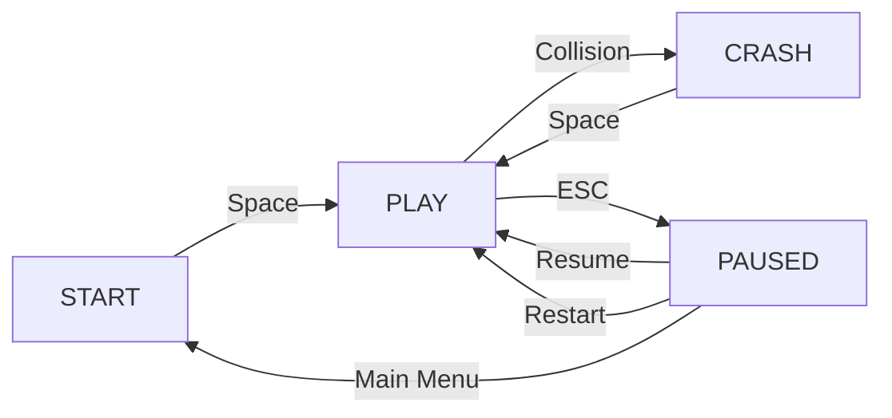

## Architecture Overview

Night Fury Radar follows a traditional game architecture pattern with distinct systems:

<CardGroup cols={3}>
  <Card title="State Management" icon="database">
    Centralized game state with mode transitions
  </Card>
  <Card title="Game Loop" icon="rotate">
    Update-draw cycle at 60 FPS
  </Card>
  <Card title="Entity Systems" icon="cubes">
    Player, obstacles, pulses, and powerups
  </Card>
</CardGroup>

## State Management

### Game State Object

The game uses a central `STATE` object to manage the current mode and score:

```javascript app/components/NightFuryRadar.js:23-30
const STATE = {
  mode: "START",        // Game mode: START, PLAY, PAUSED, CRASH
  score: 0,             // Current distance traveled
  highScore: 0,         // Best score this session
  crashTimer: 0,        // Countdown during crash sequence
  crashDuration: 80,    // Total crash animation frames
  pauseSelection: 0,    // 0 = Resume, 1 = Restart, 2 = Main Menu
};
```

### Mode Transitions

The game operates in four distinct modes:



<AccordionGroup>
  <Accordion title="START Mode" icon="play">
    **Entry**: Game initialization or returning from pause
    
    **State**:
    - Displays title screen and instructions
    - Animated background particles
    - High score display (if available)
    - Waits for Space key to begin
    
    **Code**: `drawStart()` function at line 809
  </Accordion>
  
  <Accordion title="PLAY Mode" icon="gamepad">
    **Entry**: Space pressed from START or CRASH, or Resume from PAUSED
    
    **State**:
    - Active gameplay
    - Player physics updates
    - Obstacle generation and collision
    - Score increments
    - Pulse system active
    
    **Code**: `update()` function at line 358
  </Accordion>
  
  <Accordion title="PAUSED Mode" icon="pause">
    **Entry**: ESC key during PLAY
    
    **State**:
    - Game frozen (no updates)
    - Menu overlay with options:
      - Resume (continue playing)
      - Restart (reset game)
      - Main Menu (return to START)
    - Arrow keys navigate menu
    
    **Code**: `drawPause()` function at line 907
  </Accordion>
  
  <Accordion title="CRASH Mode" icon="burst">
    **Entry**: Collision detected during PLAY
    
    **State**:
    - Crash animation (80 frames)
    - Screen shake effect
    - Obstacles revealed
    - High score updated if beaten
    - Red flash overlay
    
    **Code**: `triggerCrash()` and `drawCrash()` at lines 314, 974
  </Accordion>
</AccordionGroup>

## Game Loop

The game runs a continuous update-draw loop using `requestAnimationFrame`:

```javascript app/components/NightFuryRadar.js:1009-1014
function loop() {
  update();  // Update game state
  draw();    // Render to canvas
  animFrameRef.current = requestAnimationFrame(loop);
}
loop();
```

### Update Cycle

The `update()` function (line 358) handles all game logic:

<Steps>
  <Step title="Input Processing">
    Read keyboard state for movement:
    
    ```javascript app/components/NightFuryRadar.js:360-368
    const up = keys["ArrowUp"] || keys["KeyW"];
    const dn = keys["ArrowDown"] || keys["KeyS"];
    const rt = keys["ArrowRight"] || keys["KeyD"];
    const lt = keys["ArrowLeft"] || keys["KeyA"];

    if (up) player.vy += player.lift;
    if (dn) player.vy -= player.lift * 0.7;
    if (rt) player.vx += 0.22;
    if (lt) player.vx -= 0.14;
    ```
  </Step>
  
  <Step title="Physics Update">
    Apply gravity, drag, and velocity:
    
    ```javascript app/components/NightFuryRadar.js:370-375
    player.vy += player.gravity;
    player.vy *= player.drag;
    player.vx *= player.dragX;
    player.y += player.vy;
    player.x += player.vx;
    player.x = Math.max(40, Math.min(W * 0.65, player.x));
    ```
  </Step>
  
  <Step title="World Scrolling">
    Update scroll position and score:
    
    ```javascript app/components/NightFuryRadar.js:377-379
    const speedF = 1 + (player.x / W) * 3.5; // Dynamic speed multiplier
    scrollX += player.baseSpeed * speedF;
    STATE.score = Math.floor(scrollX / 10);
    ```
    
    <Note>
      The further right the player moves, the faster the world scrolls!
    </Note>
  </Step>
  
  <Step title="Entity Updates">
    Update all game entities:
    - Pulse waves expansion and obstacle detection
    - Powerup timers and collection
    - Obstacle fade-in/fade-out
    - Particle animations
  </Step>
  
  <Step title="Procedural Generation">
    Generate new obstacles and powerups as the world scrolls:
    
    ```javascript app/components/NightFuryRadar.js:447-457
    while (nextObs - scrollX < W + 400) {
      const top = Math.random() > 0.5;
      const ob = makePillar(nextObs, top);
      obstacles.push(ob);
      // 75% chance of creating a pair
      if (Math.random() > 0.25) {
        const pair = makePillar(nextObs, !top, ob.h);
        if (pair.h > 50) obstacles.push(pair);
      }
      nextObs += GAP + Math.random() * 80;
    }
    ```
  </Step>
  
  <Step title="Collision Detection">
    Check for collisions and trigger crash if needed:
    
    ```javascript app/components/NightFuryRadar.js:528
    if (checkCollision()) triggerCrash();
    ```
  </Step>
</Steps>

### Draw Cycle

The `draw()` function (line 552) renders everything to the canvas:

```javascript app/components/NightFuryRadar.js:552-587
function draw() {
  ctx.save();

  // Screen shake effect
  if (shake.i > 0) {
    ctx.translate(
      (Math.random() - 0.5) * shake.i * 1.5,
      (Math.random() - 0.5) * shake.i * 1.5
    );
  }

  // Background
  ctx.fillStyle = "#08081a";
  ctx.fillRect(-10, -10, W + 20, H + 20);

  // Grid pattern
  // ...

  if (STATE.mode === "START") {
    drawStart();
  } else if (STATE.mode === "PAUSED") {
    drawGame();
    drawPause();
  } else {
    drawGame();
  }

  ctx.restore();
}
```

## Obstacle Generation

Obstacles are procedurally generated using the `makePillar()` function:

```javascript app/components/NightFuryRadar.js:132-169
function makePillar(x, isTop, pairH = 0) {
  const minH = 60;
  const maxH = pairH > 0
    ? Math.max(minH, H - pairH - player.height * 3.8)
    : H * 0.6;
  const h = minH + Math.random() * (maxH - minH);
  const w = 55 + Math.random() * 70;
  const segs = 10;
  const pts = [];

  if (isTop) {
    pts.push({ x, y: 0 });
    for (let i = 0; i <= segs; i++) {
      const f = i / segs;
      const bulge = Math.sin(f * Math.PI) * w * 0.15;
      const noise = Math.sin(f * 11 + x * 0.01) * 8;
      pts.push({
        x: x + f * w + bulge + noise,
        y: f * h * 0.85 + Math.random() * h * 0.15,
      });
    }
    pts.push({ x: x + w, y: 0 });
  } else {
    // Similar logic for bottom obstacles
  }

  return { x, w, h, points: pts, opacity: 0, revealT: 0, isTop };
}
```

### Procedural Algorithm

<Steps>
  <Step title="Determine Dimensions">
    Calculate height and width with randomization:
    - **Height**: Random between `minH` (60px) and `maxH` (60% of screen or gap-constrained)
    - **Width**: Random between 55-125px
  </Step>
  
  <Step title="Generate Polygon Points">
    Create 10 segments with:
    - **Bulge effect**: `sin(f * π) * w * 0.15` for organic shape
    - **Noise**: `sin(f * 11 + x * 0.01) * 8` for surface texture
    - **Random variation**: Additional randomness per point
  </Step>
  
  <Step title="Create Pairs">
    When a pair is needed:
    - Flip `isTop` to create opposite obstacle
    - Calculate `maxH` to ensure gap is navigable (3.8 player heights)
  </Step>
</Steps>

<Warning>
  The gap between paired obstacles is only **3.8 player heights** (was 4.5 in easier versions). This makes navigation challenging!
</Warning>

## Collision Detection

Collision uses point-in-polygon testing:

```javascript app/components/NightFuryRadar.js:288-311
function checkCollision() {
  // Immunity powerup prevents collision
  if (activePowerups.immunity.active) return false;

  const cx = player.x + player.width / 2;
  const cy = player.y + player.height / 2;
  const tests = [
    { x: cx, y: player.y + 2 },                    // Top
    { x: cx, y: player.y + player.height - 2 },   // Bottom
    { x: player.x + player.width - 2, y: cy },    // Right
    { x: player.x + 4, y: cy },                   // Left
  ];
  
  for (const ob of obstacles) {
    const sx = ob.x - scrollX;
    if (sx > W + 80 || sx + ob.w < -80) continue;
    if (ob.destroyed) continue;
    
    for (const t of tests) {
      if (ptInPoly(t.x, t.y, ob.points)) return true;
    }
  }
  
  if (player.y < -5 || player.y + player.height > H + 5) return true;
  return false;
}
```

### Ray-casting Algorithm

```javascript app/components/NightFuryRadar.js:277-286
function ptInPoly(px, py, poly) {
  let inside = false;
  for (let i = 0, j = poly.length - 1; i < poly.length; j = i++) {
    const xi = poly[i].x - scrollX, yi = poly[i].y;
    const xj = poly[j].x - scrollX, yj = poly[j].y;
    if ((yi > py) !== (yj > py) && px < ((xj - xi) * (py - yi)) / (yj - yi) + xi)
      inside = !inside;
  }
  return inside;
}
```

<Tip>
  This is an implementation of the ray-casting algorithm for point-in-polygon detection, which counts how many times a ray crosses polygon edges.
</Tip>

## Powerup System

The game includes three powerup types:

```javascript app/components/NightFuryRadar.js:76-80
const POWERUP_TYPES = {
  IMMUNITY: { type: 'immunity', color: '#39ff14', symbol: '◆', duration: 180 },
  FIREBALL: { type: 'fireball', color: '#ff4444', symbol: '◉', duration: 0 },
  PLASMA: { type: 'plasma', color: '#44aaff', symbol: '◈', duration: 0 },
};
```

<CardGroup cols={3}>
  <Card title="Immunity" icon="shield">
    **Symbol**: ◆ (green)
    
    **Duration**: 180 frames (3 seconds)
    
    **Effect**: Prevents collision with obstacles. Shield effect rendered around player.
  </Card>
  
  <Card title="Fireball" icon="fire">
    **Symbol**: ◉ (red)
    
    **Duration**: One-time use
    
    **Effect**: Next pulse destroys obstacles it touches. Larger pulse radius (400px vs 650px).
  </Card>
  
  <Card title="Plasma" icon="bolt">
    **Symbol**: ◈ (blue)
    
    **Duration**: Instant
    
    **Effect**: Fully recharges pulse energy to maximum (100).
  </Card>
</CardGroup>

### Powerup Placement Algorithm

Powerups are intelligently placed to avoid obstacles:

```javascript app/components/NightFuryRadar.js:462-502
while (nextPowerup - scrollX < W + 200) {
  const types = Object.values(POWERUP_TYPES);
  const selectedType = types[Math.floor(Math.random() * types.length)];

  // Find obstacles near this X position
  const nearbyObs = obstacles.filter(ob =>
    Math.abs(ob.x - nextPowerup) < ob.w + 60
  );

  // Calculate safe Y range
  let safeMinY = 80;
  let safeMaxY = H - 80;

  for (const ob of nearbyObs) {
    if (ob.isTop) {
      safeMinY = Math.max(safeMinY, ob.h + 50);
    } else {
      safeMaxY = Math.min(safeMaxY, H - ob.h - 50);
    }
  }

  // Place powerup in safe zone
  if (safeMaxY - safeMinY > 60) {
    const centerY = (safeMinY + safeMaxY) / 2;
    const offset = (Math.random() - 0.5) * (safeMaxY - safeMinY) * 0.6;
    const puY = Math.max(safeMinY + 30, Math.min(safeMaxY - 30, centerY + offset));

    powerups.push({
      x: nextPowerup,
      y: puY,
      powerupType: selectedType.type,
      color: selectedType.color,
      symbol: selectedType.symbol,
      pulse: 0,
    });
  }
  nextPowerup += 600 + Math.random() * 400;
}
```

## Next Steps

<Card title="Rendering Pipeline" icon="paintbrush" href="/development/rendering">
  Learn about the canvas rendering system, visual effects, and particle systems
</Card>